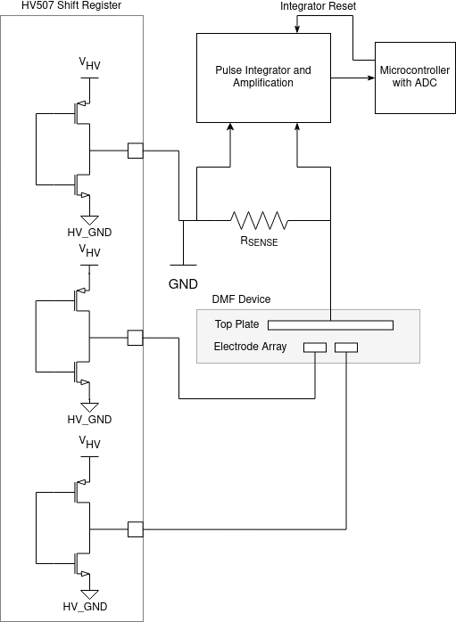
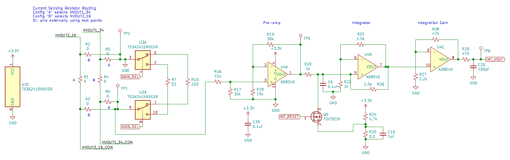
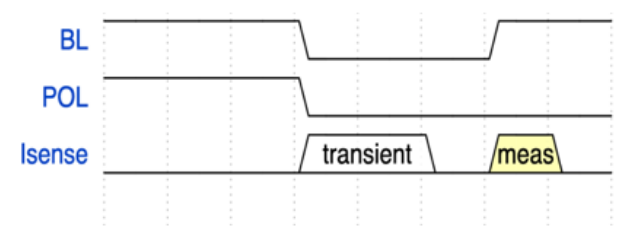
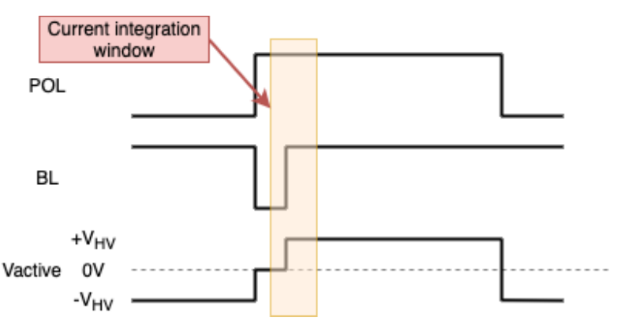
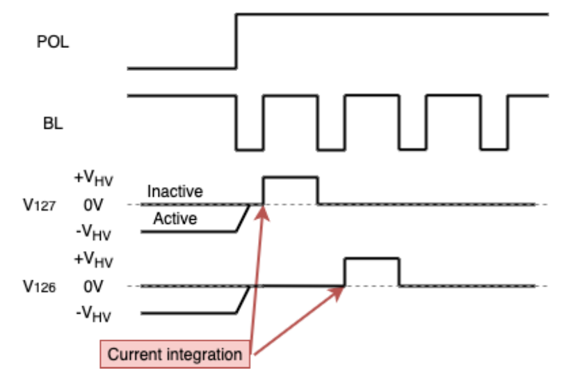

Capacitance Measurement
=======================

PurpleDrop supports capacitance sensing which can be used to detect the
presence and volume of drops on the electrode array, and this information
can then be used as feedback for control of the device.

What is Measured
----------------------

The embedded software on PurpleDrop provides capacitance measurement in two
forms: the "active" capacitance and the "scan" capacitance. The active
capacitance is measured every time the activated electrodes are charged at
500Hz. This value gives the total capacitance of all currently active electrodes.

Every 500ms, the PurpleDrop briefly disables the active electrodes and performs
a scan of all electrodes, activating each in sequence and measuring its
capacitance. This yields an array of 128 values, each representing the
capacitance measured on a single electrode.

In the future, additional modes are envisioned in which multiple regions can
be defined and measured at high frequencies in order to support features such
as feedback controlled drop splitting to regulate volume.

How Capacitance is Measured
---------------------------

The PurpleDrop uses a "coulomb counting" method of capacitance measurement,
integrating the current to determine the total charge transferred. This method
was chosen -- instead of, for example, an AC impedance measurement --
because it integrates easily with the digital outputs of the HV507 high
voltage driver. It has the added benefit of effectively hiding parasitic
capacitances from the measurement, as it is measuring the charge transfer
between two steady states (i.e. electrodes uncharged, and electrodes completely
charged and stable).

In order to achieve an alternating voltage on the device, the PurpleDrop swaps
the polarity of the HV507 outputs at 500Hz. Rather than being connected to
ground, the top-plate is connected to one of the 128 high voltage output pins.
To apply a positive voltage, the top-plate pin -- along with all inactive pins --
is driven low and active pins are driven high. To apply a negative
voltage, the top-plate is driven high along with all inactive pins and the active
pins are driven low.

  Figure 1

A sense resistor is placed in series with the top-plate output pin to measure
the top-plate current. The voltage across the sense resistor is integrated with
an op-amp integrator circuit. The microcontroller uses its ADC to measure the
output of the integrator before switching a set of electrodes, and again after
they have been charged and all transient currents have settled. The measurement
gives the total charge transferred Q, and the capacitance is simply C = Q / V_HV.

Current Integration
-------------------

.. _figure2:

  Figure 2

The integrator circuit consists of three opamps:

- A pre-amp stage to provide a high-impedance input
- A Deboo Integrator, which integrates the voltage input by storing charge on C9
- An output gain that scales the relatively small integrator output voltage to
  a reasonable range for the ADC.

A FET (Q5) allows the microcontroller to discharge the integrator capacitor in
preparation for a new integration. This FET discharges the capacitor to a small
voltage instead of to ground in order to avoid saturating the integrator opamp
output and triggering a recovery delay.

U3 is an analog mux used to select between one of two current sense resistors
to provide two gain levels. The low gain level is used for measuring larger
capacitances, which can occur when activating many electrodes concurrently
or when activating electrodes with large areas such as reservoirs.

R2 through R6 are steering resistors which allow the current sense circuit to
be connected to different pins of the HV507, or to testpoints.

The integrator has a constant ramp voltage, even when when input is 0V, due to
the small offset of the pre-amp stage. This offset can be calibrated for easily,
but it does lower the headroom for capacitance measurement.

Handling Large Common-Mode Voltage
----------------------------------

One of the first issues to arise when connecting the sense resistor to the
integrator is the very large common mode swing on the sense resistor. The
PurpleDrop high voltage supply can go as high as 300V, which would easily 
damage the opamp. The solution to this is to isolate the high voltage
supply from the main circuitry, and to tie the opamp ground to the top-plate
output on the HV507. This means that the top-plate will stay at 0V, and the
isolated high voltage ground will float to -300V when the top-plate is driven
high. The PurpleDrop board was designed to minimize parasitic capacitance
bewtween the isolated ground and main ground domains, as this capacitance will
have to be charged and discharged on every polarity switch by a single pin of
the HV507, and we've seen that too large of a load capacitance can damage the
HV507.

Measurement Sequencing
----------------------

The capacitance measurement is always made while driving the electrode high and
holding the top-plate low. When switching polarity, there are substantial
transient currents, even for electrodes which are inactive. Consider the case of
an inactive electrode during polarity switching: It is switched at the
same time as the top plate, and so in principle no voltage should be
created across the device. However, the inactive electrode driver has parasitic
capacitances (e.g. from traces and from the IO pad itself) which must be charged,
and is not perfectly matched to the top plate output -- especially considering
the potential for difference in capacitive load -- so they will not slew at the
same rate.

The result of all of this is that these "parasitic" currents vastly exceed the
signal we are trying to measure, so we need to first bring
everything to a steady state and then charge only the electrode(s) that we
wish to measure. Fortunately, the HV507 has BLANK and POLARITY features that
make this easy to do. The POL (polarity) pin on the HV507 inverts the sense of
all outputs, and the BL (blank) pin causes all outputs to go to the inactive 
state (it is equivalent to writing all zeros to the shift register, without 
having to transfer the whole shift register).

.. _figure3:

  Figure 3: HV507 timing sequence during capacitance measurement

Asserting the blanking pin during the polarity switch allows all outputs to
stabilize, and when it is released, the active outputs only are driven high
together. Figure 4 shows two oscilloscope captures, the first without a drop 
present and the second with a drop covering the electrode being measured.

.. _figure4:
.. figure:: images/scope_capture.png
  :align: center
  :width: 80%

  Figure 4: Note that integration time shown is longer than actual implementation

Current Integration Times
-------------------------

For a typical electrode, the maximum capacitance (when fully covered by a drop)
is around 10pF, and a current integration time of 10us is sufficient. However, 
for larger electrodes, the integration time may need to be increased. The 
electrode board definition file allows for a subset of the electrodes to be 
designated as "large", and for these electrodes the lower gain setting is used,
along with a longer integration time.
Both the high-gain and low-gain integration times are configurable parameters,
which can be adjusted from the *Parameters* form on the UI. 

Noise and Low-side Augmentation
-------------------------------

Rev 6 of the PurpleDrop hardware suffered from significant noise in the
capacitance measurement caused by the switching of the high voltage
regulator, which induces a current through the sense resistor. Although
these current pulses are brief and essentially zero-mean, they still show up
as a non-zero-mean error signal in the integrator output, as the integrator cannot
integrate the negative part of the current ripple. This problem is rooted
in the fact that the HV507 output has a fairly high impedance, and it was
solved by adding an additional FET to augment the low-side of the top plate
pin on the HV507, which helps to drive the main GND to the isolated
REFGND net during current sensing.

This "augment" FET will be included on future revisions of the board design, 
but it should be added to a rev6 board when accurate capacitance measurement
is needed.

Sources of Error
----------------

It seems clear that the primary source of error is not in measuring the charge
transfer, but in relating the charge transfer to the volume of fluid covering 
the electrode. The two main sources of error appear to stem from geometric
concerns and dielelectric properties.

Computing Volume
^^^^^^^^^^^^^^^^

As long as the fluid being used is somewhat conductive, we we can assume that
all of the voltage drop will be across the dielectric and the fluid itself will
have no drop once steady state is reached. This means that the capacitance will
be proportional to the area covered by the drop, and volume is the product of
the area covered and the gap height between the electrodes and top plate.

It is possible to measure this height, but some error
can creep in if, for example, the top plate is mounted at slight angle so
that the gap is not constant. 

Dielectric Hysteresis
^^^^^^^^^^^^^^^^^^^^^

The current integration does a good job of measuring capacitance if we define
it as the amount of charge transferred to raise the electrode voltage from 0V
to V_HV. However, physics has some wrenches to throw still. Our capacitor is
not ideal, and the amount of charge required to do this may not be constant. 
In fact, it can depend on the previous state of the dielectric. The first 
challenge that presented itself when testing capacitance sensing was that the 
measured capacitance was found to depend on whether an electrode was previously
activated before measurement, and on how long it had been since it was last charged
to a negative voltage.

.. _figure5:

  Figure 5: Timing diagram illustrating the "active" capacitance measurement

During active capacitance measurement (figure 5), the charge transfer is measured from 0V 
to +V_HV volts. However, in all measurements the dielectric was charged
to -V_HV a short and constant time before the current measurement. 

.. _figure6:

  Figure 6: Timing diagram illustrating the "scan" capacitance measurement

During the capacitance scan (figure 6) the dielectric covering the electrode
being measured may have been recently charged negatively, or it may not have, 
depending on whether the electrode is active. Even among active electrodes, the
time elapsed since being charged negatively varies based on the electrode 
number (pin 127 is measured first, pin 0 is measured last). The time between 
the first and last measurement can vary depending on integration time and 
blanking settings, but it is typically on the order of 2ms. 

The amount of hysteresis depends on the material and the temperature. Kapton film
dielectrics have been found to have extreme hysteresis, with the measured capacitance 
more than doubling when the dielectric is driven negatively (active)prior to measurement 
relative to not being driven negative (inactive). Mylar film has a measurable, but
much less pronounched increase of approximately 15% at room temperature, but it has been 
found to increase at higher temperatures. 

A detailed exploration of the material properties is a full topic on its own. Here,
the main takeaway for operating PurpleDrop is that the scan capacitance is
useful for determining the presence of drops on the board, but for the most
accurate volume estimate the active capacitance should be preferred.

